# Table of Contents
- [Introduction](#introduction)
- [Standards and Guidelines](#standards-and-guidelines)
  - [General Guidelines](#general-guidelines)
  - [Layers & Modularity](#layers--modularity)
    - [Staging Layer](#staging-layer)
    - [Intermediate Layer](#intermediate-layer)
    - [Analytics Layer](#analytics-layer)
  - [Documentation & Testing](#documentation--testing)
- [Methodology](#methodology)
  - [Tools & Technologies](#tools--technologies)
  - [Data Sources](#data-sources)
  - [Observations & Decisions](#observations--decisions)
  - [Data Lineage](#data-lineage)
  - [Data Insights & Visualizations](#data-insights--visualizations)
    - [Top 20 Highest-Grossing Films of All Time](#top-20-highest-grossing-films-of-all-time)
    - [Top 10 Most Appearing Actors of All Time](#top-10-most-appearing-actors-of-all-time)
    - [Top 10 Highest-Grossing Directors of All Time](#top-10-highest-grossing-directors-of-all-time)
    - [Top 10 Directors with the Most Oscar Wins](#top-10-directors-with-the-most-oscar-wins)
    - [Top 10 Highest-Grossing Writers of All Time](#top-10-highest-grossing-writers-of-all-time)
    - [Who Votes for Movies on IMDb?](#who-votes-for-movies-on-imdb)
    - [Warner Bros. Pictures is #1 Money-Making Production Company](#warner-bros-pictures-is-1-money-making-production-company)
    - [Warner Bros. Pictures' Most Successful Projects](#warner-bros-pictures-most-successful-projects)
- [Conclusion](#conclusion)

---

# Introduction
**[Data Modeling Challenge - Movie Edition](https://www.paradime.io/dbt-data-modeling-challenge-movie-edition), hosted by Paradime!**
Throughout this project, I tried to design and build a data transformation architecture that is **simple**, **elegant**, **easy-to-maintain**, and **reliable**. My work is designed to empower my _hypothetical_ downstream data consumers, such as Data Analysts and Data Scientists, and enable them to derive valuable insights from the movie industry data. My primary focus has been on ensuring top-notch data quality and simplicity in design. These principles form the cornerstone of the framework.

It takes years to build trust and reputation with your stakeholders, and just one inaccurate report/dashboard ruins it all.

# Standards and Guidelines
**TL;DR** If you see something "werid" in my work, the standards below likely explain the reasoning behind it.

Throughout this project, I stayed true to my principles when it came to working with data and collaborating with other developers. This not only aligns with my personal commitment to best practices but also makes the data models easier to understand and maintain, whether for myself or for anyone reviewing my work. Here are some standards and rules I have chosen to practice and uphold throughout this project.

## General Guidelines
- Don't Repeat Yourself (DRY) - a fundamental practice in software development that emphasizes the importance of minimizing repetition within the codebase.
- Any data transformation should be done as far upstream as possible (respecting other standards and rules).
- The storage is dirt-cheap, compute is expensive, do not optimize (i.e. normalize) data for less storage. Runtime and compute cost is what matters.

My favorite principles from [PEP 20 – The Zen of Python](https://peps.python.org/pep-0020/#the-zen-of-python)
- Beautiful is better than ugly.
- Explicit is better than implicit.
- Simple is better than complex.
- Complex is better than complicated.
- Flat is better than nested.
- Readability counts.
- Special cases aren't special enough to break the rules.
- Errors should never pass silently.
- If the implementation is hard to explain, it's a bad idea.

## Layers & Modularity
Any data model in this project falls under one of these transformation layers:

### Staging Layer
Staging models are designed to provide a proxy layer on raw/source data.
- All source tables and views should have a corresponding staging model before they can be used/referenced in the dbt project.
- Only staging models may select from source tables or views.
- Only a single staging model should be able to query/select from a specific source table or view.
- All lowest-level data transformations (i.e. transformations that doesn't require joining data) should be done in the staging layer.
- Staging models should not be used to join data.
- Staging models are for internal use only and should not be exposed to downstream data consumers, including the BI layer (e.g., Lightdash, Looker, Tableau, etc.) or ML/AI Ops.

### Intermediate Layer
Intermediate models provide higher-level transformations, including data joining, complex business logic transformations, and data enrichment.
- Intermediate models offer a strategic way to manage complex transformations in smaller, more manageable parts, enhancing performance and organizing code that is utilized across various models.
- Intermediate models can only reference other models, but never directly a source.
- Not all the data transformation pipelines/lineages require intermediate layer nodes.
- Intermediate models are for internal use only and should not be exposed to downstream data consumers, including the BI layer (e.g., Lightdash).

### Analytics Layer
Analytics models are business-centric entities, where every model is a business unit (e.g., `movies`, `tv_series`, `crew`, `actors`, `tickets`, etc.).
- Analytics models deliver finalized, business-ready datasets optimized for analysis, reporting, and other business applications.
- For downstream performance considerations, analytics models should be configured as tables.
- Analytics models can select from `staging`, `intermediate`, and other `analytics` models, but never from sources, ensuring data has been properly transformed and validated before use.
- Only analytics models are client-facing and can be exposed to downstream data consumers, including the BI layer (e.g., Lightdash).

## Documentation & Testing
- All models should have a corresponding `<model_name>.yml` file in the same directory as the `<model_name>.sql` file.
- All models should have a `final` CTE that explicitly list all the columns of the model output.
- All columns in the `final` output should be documented to indicate what the data in the column is, where it comes from, how it is calculated.
- At a minimum, every model should have a primary key and should include `unique` and `not_null` checks on it.
- In cases where a source table lacks a conventional primary key, use the  `dbt_utils.generate_surrogate_key()` macro to create a surrogate key.
- In-line comments should be used extensively to help document coding or query decisions, or to clarify the purpose or outcome of the SQL.
- Comments should explain the *why* rather than *how* (code alone should be sufficient for the *how*).

# Methodology
## Tools & Technlogies
- [dbt](https://www.getdbt.com/) - SQL management framework.
- [Paradime](https://www.paradime.io/) - managed service that provides a web-based UI for development, testing, deployment and orchestration of the SQL management framework - dbt Core. Like dbt Cloud, but better 😉.
- [Snowflake](https://www.snowflake.com/en/) - a centralized data warehouse where we store raw, processed, and ready-for-reporting and analysis data.
- [Lightdash](https://www.lightdash.com/) - a lightweight BI tool for visualizing data. Like Looker, but simpler 😉.
- [Snowflake Stages](https://docs.snowflake.com/en/sql-reference/commands-data-loading) - used to load static raw/source data into Snowflake.

## Data Sources
|Source |Origin |Ingestion Method |Comments |
|-------|-------|-----------------|---------|
|[TMDB_MOVIES](models/staging/tmdb/source.yml)|[TMDb API](https://developer.themoviedb.org/docs/getting-started)|Provided by team Paradime
|[TMDB_TV_SERIES](models/staging/tmdb/source.yml)|[TMDb API](https://developer.themoviedb.org/docs/getting-started)|Provided by team Paradime
|[OMDB_MOVIES](models/staging/omdb/source.yml)|[OMDb API](https://www.omdbapi.com/)|Provided by team Paradime
|[PRINCIPALS](models/staging/imdb/source.yml)|[IMDb Developer](https://developer.imdb.com/non-commercial-datasets/)|Python + [Snowflake Stage](https://docs.snowflake.com/en/sql-reference/commands-data-loading)
|[NAMES](models/staging/imdb/source.yml)|[IMDb Developer](https://developer.imdb.com/non-commercial-datasets/)|Python + [Snowflake Stage](https://docs.snowflake.com/en/sql-reference/commands-data-loading)
|[Consumer Price Index](seeds/seed_enrichments__consumer_price_index.csv)|[U.S. Bureau of Labor Statistics](https://www.bls.gov/cpi/data.htm)|[dbt seed](https://docs.getdbt.com/docs/build/seeds)|For inflation adjustments
[Standard Country Names](seeds/seed_standards__country_names.csv)|[ISO 3166-1](https://en.wikipedia.org/wiki/ISO_3166-1)|[dbt seed](https://docs.getdbt.com/docs/build/seeds)|To unify Countries
[Standard Languages](seeds/seed_standards__languages.csv)|[ISO 639-2](https://en.wikipedia.org/wiki/List_of_ISO_639-2_codes)|[dbt seed](https://docs.getdbt.com/docs/build/seeds)|To unify Languages

 

## Observations & Decisions
- All financial stats, such as estimated budget and gross revenue (aka box office), were adjusted for inflation as of 2024. Adjusting movie financial statistics for inflation ensures comparability and provides a fair benchmark across different production years, allowing for accurate and meaningful data analysis.
Example: The movie "Titanic (1997)" earned approximately 2.26 billion USD worldwide in 1997. Adjusted for inflation, this would be 4.35 billion USD in 2024.
 
- After examining provided data sources, I found that neither TMDb or OMDb datasets can be considered entirely reliable or serve as sources of truth. These datasets occasionally present contradictory information. However, after some digging, I found TMDb to be more reliable overall. Therefore, in this project, in cases of conflict, I prioritize TMDb data over OMDb data.
 
- In the provided TMDb dataset, the same `tmdb_id` can be shared across both 'Movies' and 'TV Series', which makes it unreliable for data quality and governance purposes.
Example:
    - https://www.themoviedb.org/movie/220387 Blogumentary (2004)
    - https://www.themoviedb.org/tv/220387 Camp Radio (2022)
 
- Given the volume and nature of this data, I chose not to apply any optimization techniques, such as incremental materialization, selecting the appropriate incremental strategy, explicit clustering of Snowflake tables, etc. The entire DAG, which includes 13 models, 3 seeds, and 22 tests, runs (`dbt build`) in under 2 minutes on an XS-size warehouse.

 

## Data Lineage
Unfortunately, Paradime doesn't support generating lineage from a dbt Exposure node (requested a feature). As a result, from the Paradime platform perspective, I end up with two lineages (separate data transformation pipelines/DAGs) that both roll up to the `media` dbt Exposure.

The main node in the linage is the analytics model - [media](models/analytics/media/media.sql), that combines 'Movie' and 'TV Series' data from various sources (both current and future), detailing, enriching, and standardizing attributes relevant to both media types. The grain of the model is a media record ('Movie' or 'TV Series' object), with internally generated primary key - `record_key`, since, as mentioned above, the same `tmdb_id` can be shared across both 'Movies' and 'TV Series' in the TBDb data source.

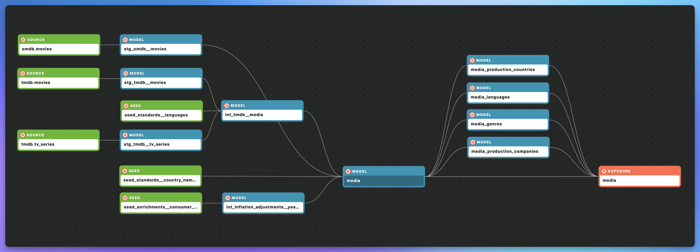
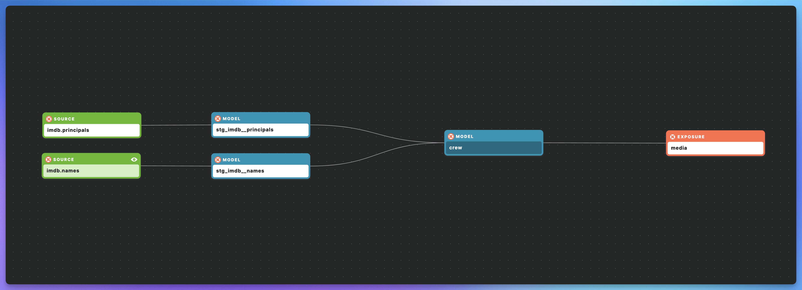

The `media` is a holistic, client-facing model that is being exposed to end users in the BI layer - Lightdash. All other analytics models join it in the Lightdash [semantic layer](models/analytics/media/media.yml).

Since Lightdash doesn't manage Snowflake's semi-structured data types (objects and arrays) and to keep the model's grain intact, I had to flatten arrays in the `media` model (like `genres` and `production_companies`) into their own analytics models (`media_genres`, `media_production_companies`). I then joined them back to the `media` model in Lightdash's semantic layer. This isn't a circular dependency because these joins technically occur outside the dbt project, even though they are declared within it.

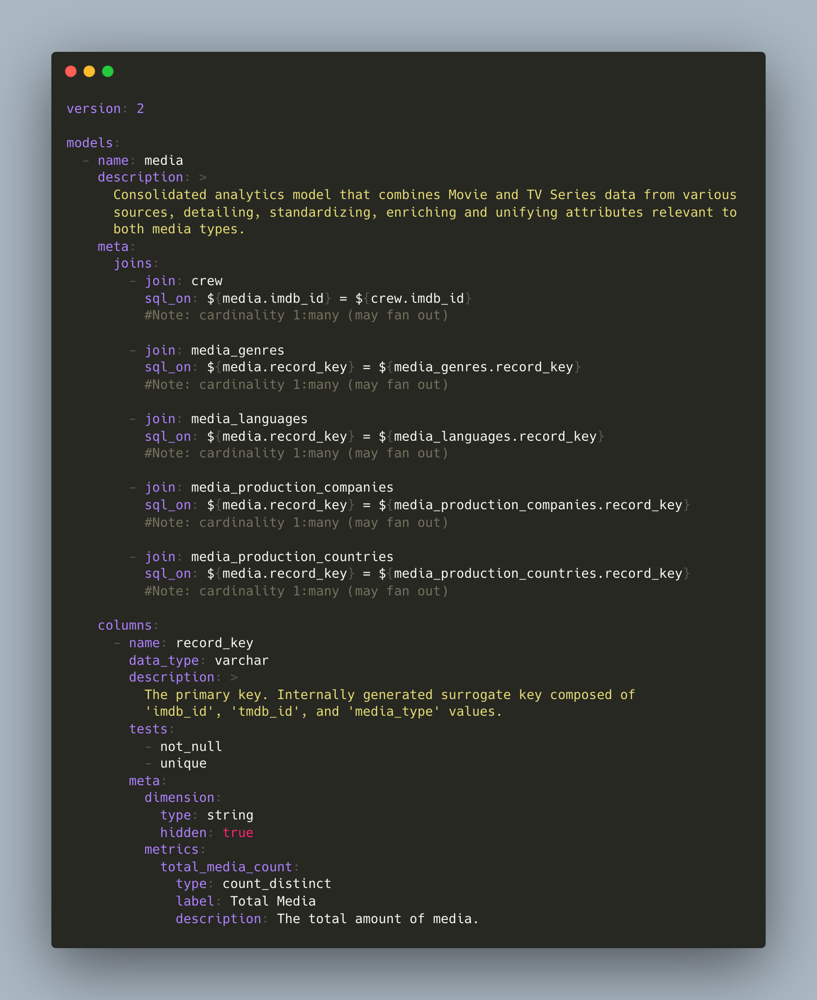

 

## Data Insights & Visualizations
### Top 20 Highest-Grossing Films of All Time
[Gone with the Wind (1939)](https://www.imdb.com/title/tt0031381/) appears to be the highest-grossing film of all time. Back then it earned \$402 million in box office revenue. Adjusted for inflation, that amount would be equivalent to \$8.7 billion in 2024.
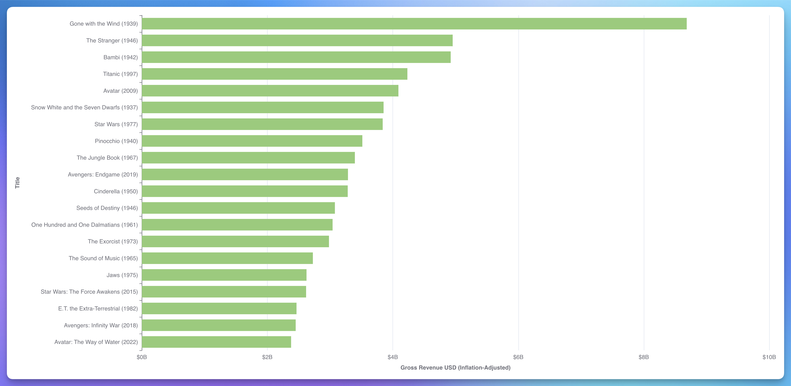
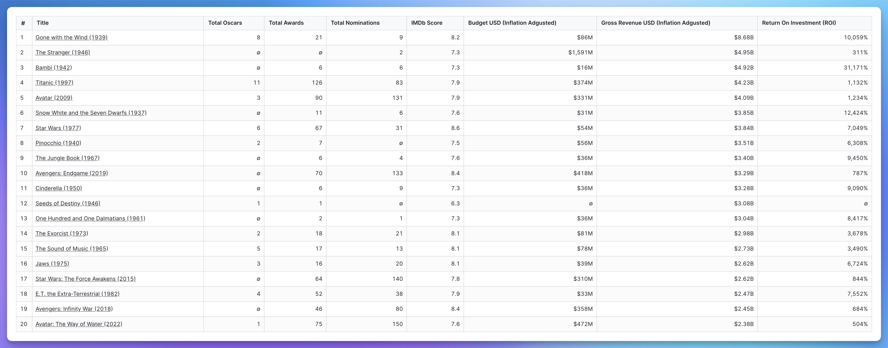

 

### Top 10 Most Appearing Actors of All Time
[Mel Blanc (1908-1989)](https://www.imdb.com/name/nm0000305/), famously known as ["The Man of a Thousand Voices"](https://en.wikipedia.org/wiki/Mel_Blanc), is considered one of Hollywood's most prolific actors with over a thousand screen credits. He created and performed nearly 400 distinct character voices, becoming renowned worldwide for his work in radio, television, cartoons, and movies.

 

### Top 10 Highest-Grossing Directors of All Time
[Steven Spielberg](https://www.imdb.com/name/nm0000229/) is one of the most influential personalities in the history of cinema, and Hollywood's best-known director, as well as one of the wealthiest filmmakers in the world. He has directed, produced, or written an extraordinary number of commercially successful and critically acclaimed films, beginning with the launch of the summer blockbuster with "Jaws" (1975). Known for iconic movies like "E.T. the Extra-Terrestrial," "Jurassic Park," "Indiana Jones," and "Schindler's List," Spielberg has done more to define popular filmmaking since the mid-1970s than anyone else, leaving a lasting impact on the film industry.
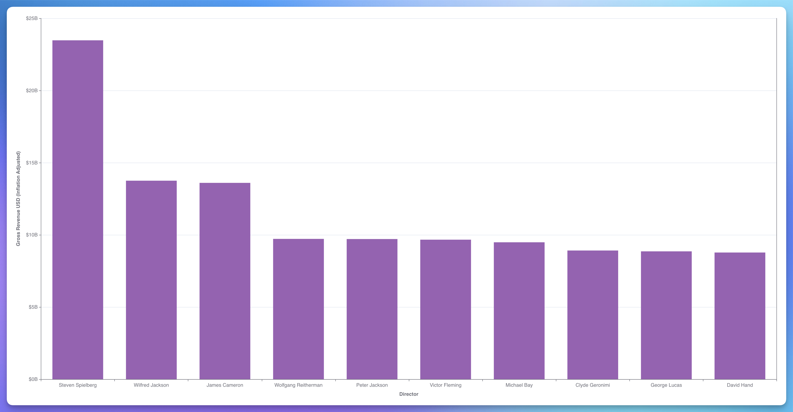

 

### Top 10 Directors with the Most Oscar Wins
[William Wyler (1902-1981)](https://www.imdb.com/name/nm0943758/) was a renowned American film director, producer, and screenwriter known for his exceptional storytelling and meticulous direction. He is celebrated for winning three Academy Awards for Best Director for the films "Mrs. Miniver" (1942), "The Best Years of Our Lives" (1946), and "Ben-Hur" (1959). His work on "Ben-Hur" also contributed to the film winning a record-setting 11 Oscars. Throughout his career, Wyler received a total of 12 nominations for Best Director, more than any other director in history, cementing his legacy as one of Hollywood's most honored and influential filmmakers.
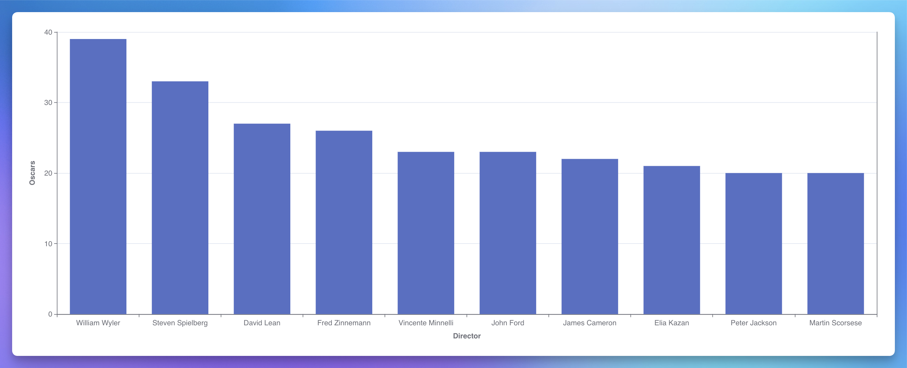

 

### Top 10 Highest-Grossing Writers of All Time
[Stan Lee (1922-2018)](https://www.imdb.com/name/nm0498278/) was a legendary American comic book writer, editor, and publisher, best known for his work with Marvel Comics. He co-created iconic superheroes such as **Spider-Man**, the **X-Men**, **Iron Man**, **Thor**, **the Hulk**, **Black Widow**, **Black Panther**, and the **Fantastic Four**, revolutionizing the comic book industry with his dynamic characters and complex storytelling.
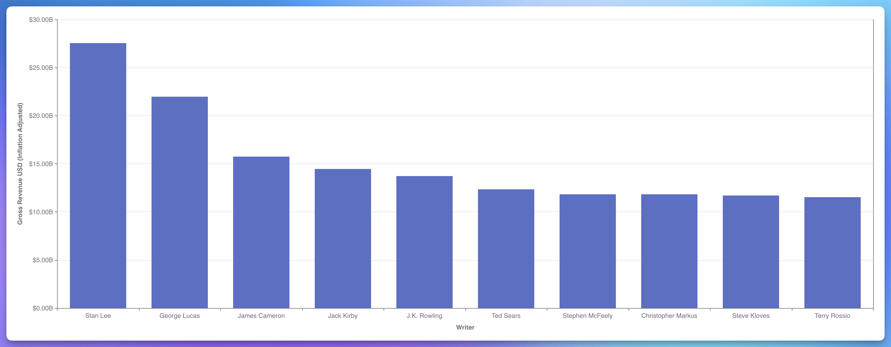

 

### Who Votes for Movies on IMDb?
There seems to be a moderate to strong correlation (unfortunately Lightdash doesn't show correlation coefficient) between a movie's IMDb score and the number of votes it received. Although correlation isn't usually causation, this relationship may suggest that the more someone likes a movie, the more likely they are to visit the [IMDb website](https://help.imdb.com/article/imdb/track-movies-tv/ratings-faq/G67Y87TFYYP6TWAV#) and vote for it.
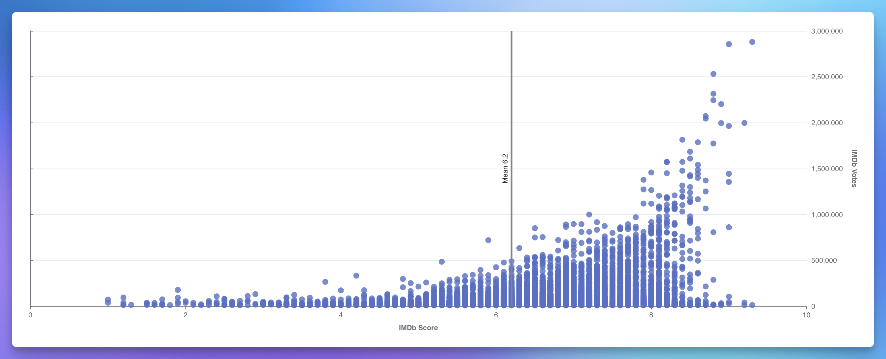

 

### Warner Bros. Pictures is #1 Money-Making Production Company
Although this doesn't directly related to Profit or Return On Investment (RIO), the [Warner Bros. Pictures](https://en.wikipedia.org/wiki/Warner_Bros._Pictures) appears to be a leader in the movie production industry based on gross revenue (box office), the total number of movies produced, and the number of Oscars their movies have received.
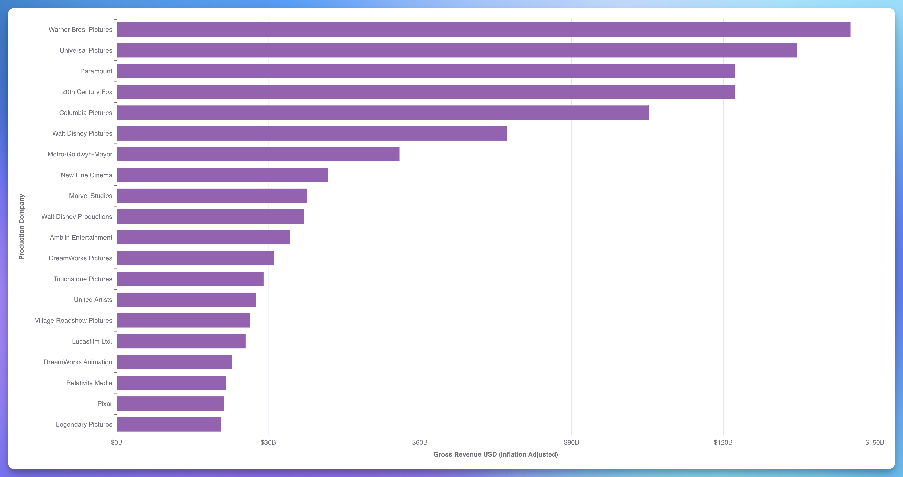
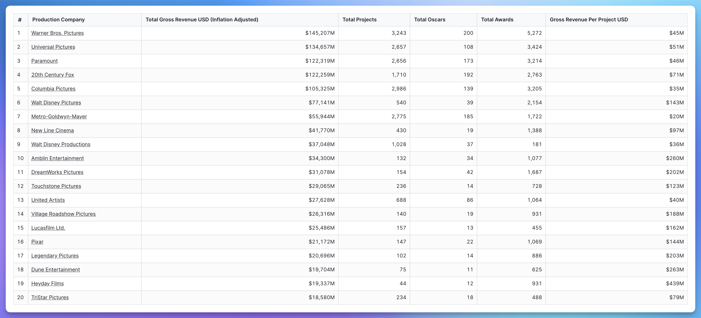

 

### Warner Bros. Pictures' Most Successful Projects
11 of [Warner Bros. Pictures](https://en.wikipedia.org/wiki/Warner_Bros._Pictures)' 20 most successful projects are **Harry Potter** and **The Hobbit** sequels.
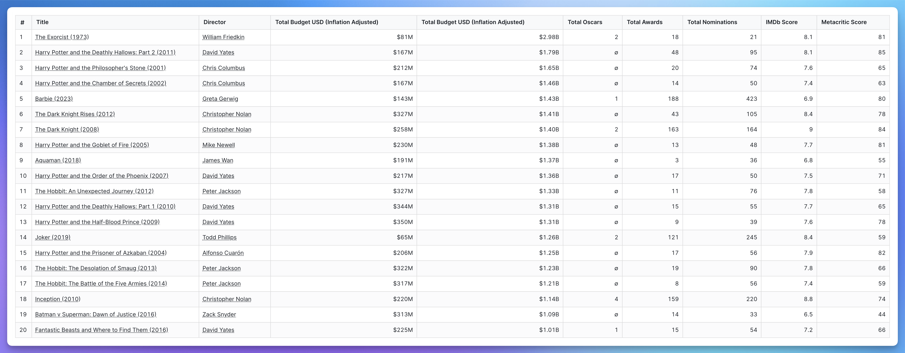

# Conclusion
In conclusion, the Data Modeling Challenge - Movie Edition presented an intriguing opportunity to design a robust and scalable data transformation architecture. Throughout this project, I tried to demonstrate the importance of creating high-quality, reliable, and scalable data models and BI explore that empower downstream users and ultimately drive valuable insights, regardless of the industry. In my example, the final holistic `media` analytics model and pre-built Lighdash Explore should answer any business question a user might have about this industry.
