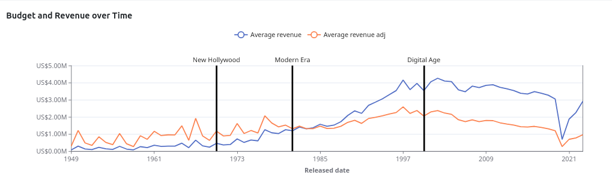
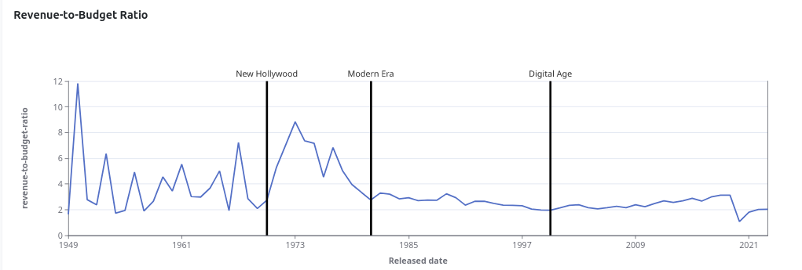
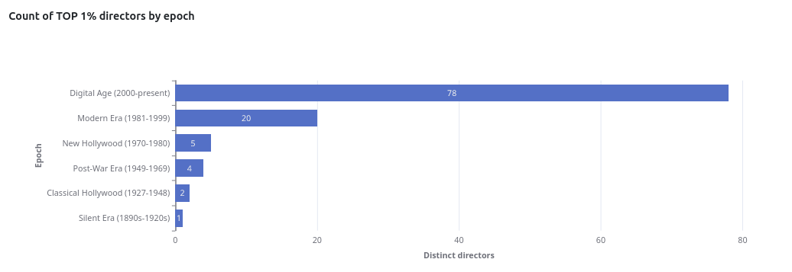
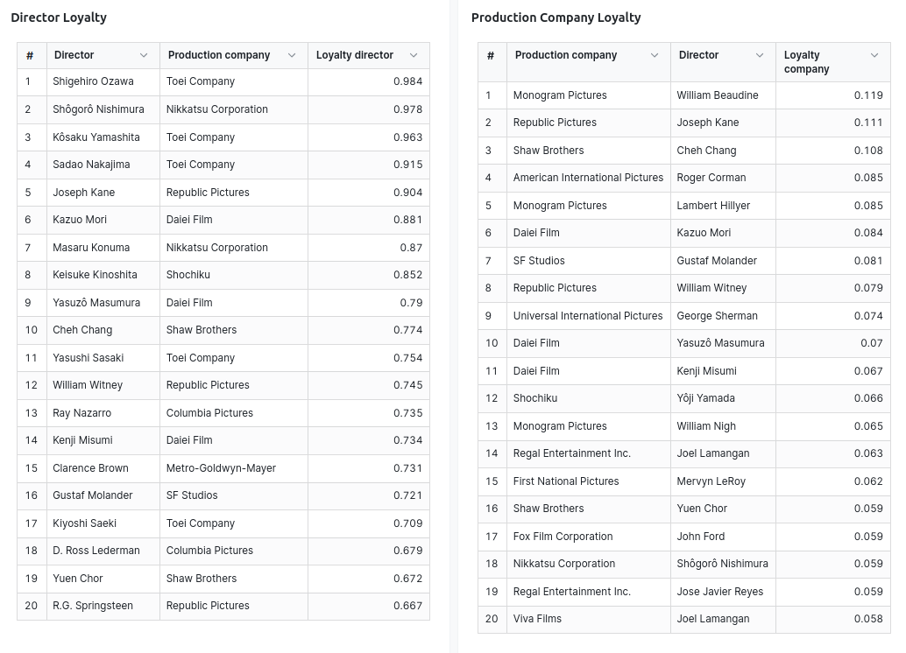

# dbt™ Data Modeling Challenge - Movie Edition

## Table of Contents
1. [Introduction](#introduction)
2. [Data Sources](#data-sources-and-data-lineage)
3. [Methodology](#methodology)
   - [Tools Used](#tools-used)
   - [Applied Techniques](#applied-techniques)
   - [Data Sources and Data Lineage](#data-sources-and-data-lineage)
4. [Visualizations](#Visualizations)
   - [Navigate the Film Industry Growth](#Navigate-the-Film-Industry-Growth)
   - [Exploring Movie Budget and Revenue Over Time Dashboard](#Exploring-Movie-Budget-and-Revenue-Over-Time-Dashboard)
   - [Exploring Revenue-to-Budget Ratios](#Exploring-Revenue-to-Budget-Ratios)
   - [The Rise of Diversity in the Digital Era](#The-Rise-of-Diversity-in-the-Digital-Era)
   - [Unveiling Director-Production Company Loyalty](#Unveiling-Director-Production-Company-Loyalty)
5. [Conclusions](#conclusions)

## Introduction
Explore my project for the _dbt™ data modeling challenge - Movie Edition_, Hosted by [Paradime](https://www.paradime.io/)!

This project dives into the analysis of evolution of Film Industry.

[Source code](https://github.com/paradime-io/paradime-dbt-movie-challenge/tree/movie-robertas-kudulis-pigu-lt)

## Data Sources and Data Lineage
My analysis leverages two key data sets provided by Paradime:
- *OMDB movies dataset*
- *TMDB movies dataset*

Aditional Data Sources:
- *CPI data* (inflation) by [U.S. Bureau of Labor Statistics](www.bls.gov)

## Methodology
#### Tools Used
- **[Paradime](https://www.paradime.io/)** for SQL, dbt™.
- **[Snowflake](https://www.snowflake.com/)** for data storage and computing.
- **[Lightdash](https://www.lightdash.com/)** for data visualization.
- Python's networkx library was utilized for network exploratory data analysis, although basic statistics were later computed within Snowflake.

### Data Lineage

## Visualizations

### Navigate the Film Industry Growth

The evolution of film production across different eras reveals significant changes in the industry. During the **Silent Era**, Hollywood emerged as the hub of movie production, with studios producing around 400 feature films annually by the 1920s.

In the **Classical Hollywood Era**, the rise of television in the post-war period led to a stagnation in the number of productions. However, the late 1950s and 1960s, part of the **Post-War Era**, saw a shift with approximately 1000 films produced annually.

During the **New Hollywood Era**, production numbers stabilized at around 2000 films annually, focusing on fewer but higher-budget blockbusters. By the late 1990s, within the **Modern Era**, the number of films produced annually ranged from 2200 to 3000.

In the **Digital Age**, the advent of digital filmmaking and streaming platforms led to a substantial increase in film production. Global numbers grow significantly higher due to contributions from major film industries like Bollywood and China's film industry.

Moving forward, the analysis will delve deeper into the post-war and subsequent eras, exploring trends in film runtime ranging from 40 minutes to 5 hours.

### Exploring Movie Budget and Revenue Over Time Dashboard

While the nominal revenue of the movie industry has generally increased over the years, adjusting for inflation (using the Consumer Price Index or CPI) reveals a different trend. From around 2005 onwards, the revenue of the movie industry, when adjusted for CPI, has faced significant challenges.

Several factors contribute to this trend:
- Streaming Platforms: The rise of streaming services like Netflix, Amazon Prime, and Disney+ has fundamentally changed how audiences consume movies. These platforms offer greater convenience and lower costs compared to traditional movie theaters, diverting viewers away from theaters and impacting box office revenue.
- COVID-19 Pandemic: The pandemic had a profound impact on the movie industry, with theaters closed or operating at reduced capacity for extended periods. This accelerated the shift towards streaming and away from traditional theaters, further challenging the industry’s revenue growth when adjusted for inflation.
- Economic Factors - 2008 Financial Crisis: Broader economic conditions, such as the 2008 financial crisis, significantly impacted discretionary spending on entertainment, including movie tickets. Economic downturns reduce consumer spending power, leading to decreased attendance and lower revenue growth for the movie industry.

## Exploring Revenue-to-Budget Ratios

Older movies frequently exhibit higher revenue-to-budget ratios, reflecting several contributing factors:
1. Lower Production Costs

    Labor Costs and Special Effects: Older movies benefited from lower labor costs and simpler special effects compared to modern productions. This kept production expenses relatively low, contributing to higher revenue-to-budget ratios.

2. Re-Releases and Comebacks

    Extended Theatrical Runs: Many classic films enjoyed extended theatrical runs, sometimes spanning years, due to limited competition and sustained audience interest. Re-releases allowed these films to generate additional revenue without significant additional production costs.

3. Economic Factors

    Inflation Considerations: Historical box office figures do not consider inflation. Older movies earned dollars with greater purchasing power than today, amplifying their revenue when adjusted for inflation. This disparity can make their revenue appear more substantial relative to their original budgets.

## The Rise of Diversity in the Digital Era

The number of top 1% directors may have increased in the digital era due to several factors. Firstly, the democratization of filmmaking technology has lowered barriers to entry, allowing more individuals to create and distribute their films. 

## Cracking the Collaboration Code: Unveiling Director-Production Company Loyalty

The analysis reveals a stark contrast in director loyalty between Hollywood and Japan, shedding light on industry dynamics and cultural influences. 

Director loyalty, measured by the percentage of movies produced within a particular production company, underscores the strength of these partnerships. In Japan, certain directors demonstrate exceptional loyalty, overseeing over 90% of their productions within the same company. This underscores strong partnerships and collaborations. 

Hollywood's competitive nature results in lower director loyalty, with studios ranking lower in the top 20. This disparity reflects varied industry dynamics and cultural influences.

Production company loyalty represents the percentage of total movies produced by a particular director within a specific production company.

Additionally, the relationships between production companies and directors are less visible. Although the top three directors produce about 10% of the related companies' movies, the loyalty measure declines faster. This suggests that production companies engage with a broader array of directors, resulting in a swifter decrease in loyalty measures.

## Conclusions

The analysis highlights the film industry's rapid evolution, especially since the early 2000s with the rise of streaming platforms and lowered barriers to entry.

Basic network analysis revealed significant differences in director loyalty between the US and Japan. In Japan, collaborations are stronger and more lasting, while Hollywood's competitive dynamics result in lower loyalty. 

However, data issues noted by the author require attention for future analyses to provide more accurate insights.