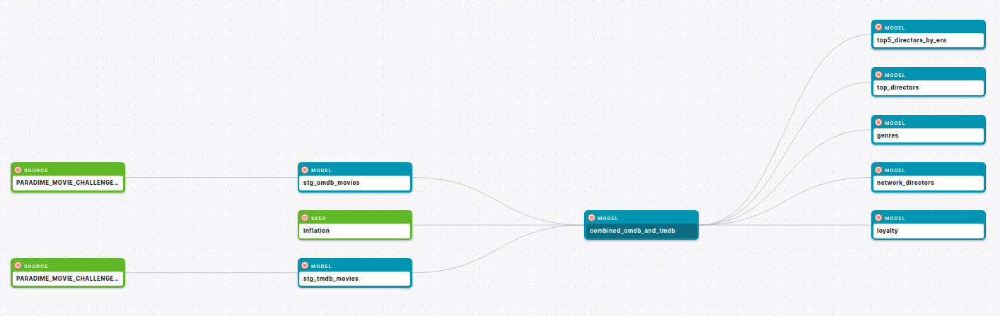

# dbt™ Data Modeling Challenge - Movie Edition

## Table of Contents
1. [Introduction](#introduction)
2. [Data Sources](#data-sources-and-data-lineage)
3. [Methodology](#methodology)
   - [Tools Used](#tools-used)
   - [Applied Techniques](#applied-techniques)
   - [Data Sources and Data Lineage](#data-sources-and-data-lineage)
4. [Visualizations](#visualizations)
   - [Vizualization #1](vizualization-1)
   - [Vizualization #2](Vizualization-2)
   - [Vizualization #3](Vizualization-3)
   - etc
5. [Conclusions](#conclusions)

## Introduction
Explore my project for the _dbt™ data modeling challenge - Movie Edition_, Hosted by [Paradime](https://www.paradime.io/)!

This project dives into the analysis of evolution of Film Industry.

Source code

## Data Sources and Data Lineage
My analysis leverages two key data sets provided by Paradime:
- *OMDB movies dataset*
- *TMDB movies dataset*

Aditional Data Sources:
- *CPI data* (inflation) by [U.S. Bureau of Labor Statistics](www.bls.gov)

## Methodology
#### Tools Used
- **[Paradime](https://www.paradime.io/)** for SQL, dbt™.
- **[Snowflake](https://www.snowflake.com/)** for data storage and computing.
- **[Lightdash](https://www.lightdash.com/)** for data visualization.
- **Python networkx library for network exploratory data analysis (although later basic statistics were computed within snowflake** 

### Data Lineage

## Visualizations

### vizualization 1
- #### Visualizations title
- #### Intro sentence to vizualization
- #### Image of vizualization
- #### Insights

### vizualization 2
- #### Visualizations title
- #### Intro sentence to vizualization
- #### Image of vizualization
- #### Insights

### vizualization 3
- #### Visualizations title
- #### Intro sentence to vizualization
- #### Image of vizualization
- #### Insights

## Conclusions
Share a clear and concise conclusion of your findings!
