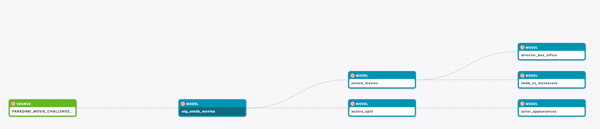
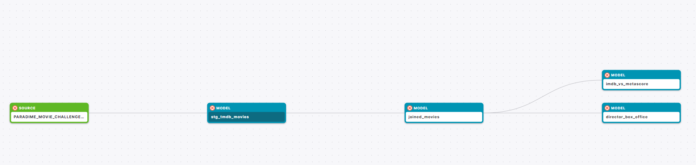
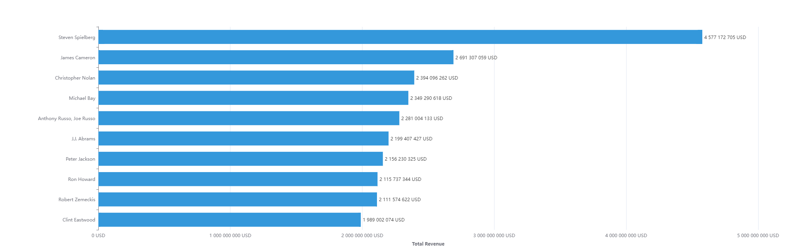
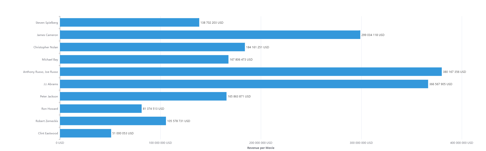
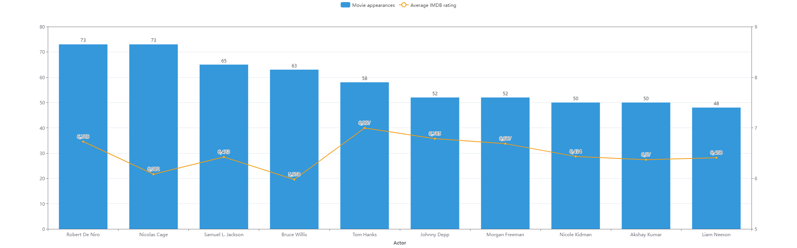
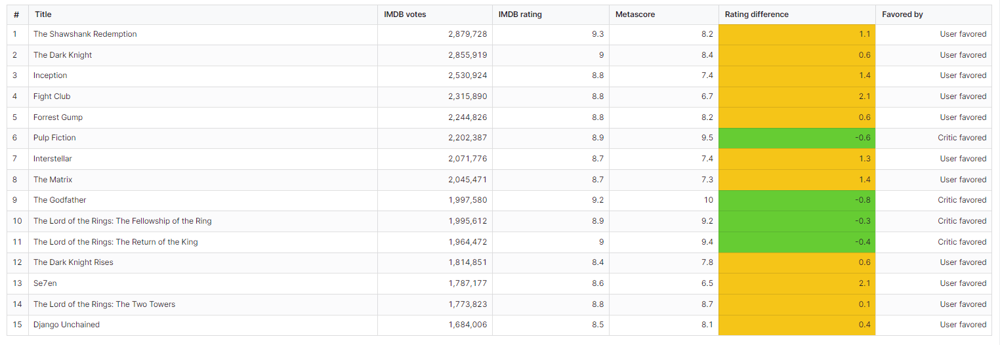
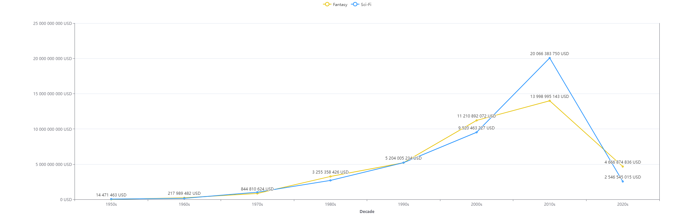

# dbt™ Data Modeling Challenge - Movie Edition

Welcome to my project for the [Paradime dbt™ Data Modeling Challenge - Movie Edition](https://www.paradime.io/dbt-data-modeling-challenge-movie-edition)!

## Table of Contents
1. [Introduction](#introduction)
2. [Data Sources](#data-sources-and-data-lineage)
3. [Methodology](#methodology)
   - [Tools Used](#tools-used)
   - [Data Sources and Data Lineage](#data-sources-and-data-lineage)
4. [Visualizations](#visualizations)
   - [Visualization #1](#visualization-1)
   - [Visualization #2](#visualization-2)
   - [Visualization #3](#visualization-3)
   - [Visualization #4](#visualization-4)
5. [Conclusions](#conclusions)

## Introduction
Explore my project for the _dbt™ data modeling challenge - Movie Edition_, Hosted by [Paradime](https://www.paradime.io/)! 
This project dives into the analysis and visualization of Movie and TV data!
My project focuses on mainstream / popular movies by filtering the datasets to exclude a vast number of lesser-known ones. 
The insights are drawn from performance metrics such as film revenue or rating and I'm also presenting interesting facts for movie enthusiasts.

## Data Sources and Data Lineage
My analysis leverages these key data sets:
- *OMDB_MOVIES*
- *TMDB_MOVIES*

### Data Lineage

## Methodology
#### Tools Used
- **[Paradime](https://www.paradime.io/)** for SQL, dbt™.
- **[Snowflake](https://www.snowflake.com/)** for data storage and computing.
- **[Lightdash](https://www.lightdash.com/)** for data visualization.
- **ChatGPT** for debugging software errors.

## Visualizations

### Visualization 1
- #### Directors' Total Revenue and Revenue per Movie
- This chart presents the most commercially successful directors, highlighting their box office total and per movie.

- **Insights**:
  - Steven Spielberg has generated the highest revenue across his many movies.
    However, if we look at the average revenue per movie for these same directors, the Russo brothers, J.J. Abrams and James Cameron perform the best, showcasing a bit more consinstency with their high-hitting movies.

### Visualization 2
- #### Actor Appearances and IMDb Ratings
- This visualization shows the number of movie appearances for each actor alongside their average IMDb ratings.

- **Insights**:
  - I've filtered for titles with at least 10000 IMDB votes, this way we can see actors whose faces we can most frequently see in popular movies.
    Robert De Niro and Nicolas Cage have a tied at the 1st place, but we know all these names very well. 
    Interestingly, Tom Hanks has the highest average IMDB score across his movies, while Bruce Willis scored the lowest on this list

### Visualization 3
- #### IMDb vs Metascore Ratings
- This visualization compares the IMDb ratings and Metascore ratings for various movies to understand the differences in user and critic ratings.

- **Insights**:
  - This table shows the movies with the highest number of IMDB votes.
    In general, we can say that for these titles, users and critics mostly agree that these are great movies.
    Given the aggregate nature of the IMDB user rating, its ceiling is lower as they can never truly reach 10/10, as we can see The Godfather has one of the highest IMDB scores still not reaching maximum, the lower number of critic reviews can result in a score of 10.
    The biggest difference in users' and critics' taste come in the 2 cult classics, Fight Club and Se7en, which critics didn't adore as much as users.

### Visualization 4
- #### Fantasy and Sci-Fi genres' evolution
- This line chart shows the evolution of the Sci-Fi and Fantasy genres over the decades based on their box office revenue.

- **Insights**:
  - I've separated the 2 genres, grouping movies into Fantasy if they have both genre tags.
    These two genres stagnated up until the 70s, where a big boost can be seen as they grow together in total revenue.
    They show a very similar trend, however in the 2010s the Sci-Fi genre got a significant lead.
    I'll be curious to see how this trend will continue in the current decade as new titles and franchises are released.

## Conclusions
In this project, we explored various facets of the movie industry through data modeling and visualization. Key insights include:
- A slight distinction between user and critic ratings for popular movies, with users often favoring different titles compared to critics.
- The most highly-regarded directors excel at consistently releasing movies that perform very well financially.
- Actor names expected to be mainstream and recognized by most people on the street have the most movie appearances in the industry.
- The evolving trends in Fantasy and Sci-Fi genres, reflecting changes in audience preferences and industry focus over the decades.
