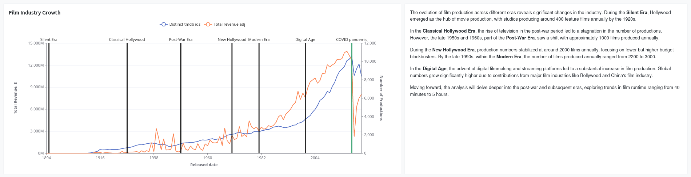

# dbt™ Data Modeling Challenge - Movie Edition

## Table of Contents
1. [Introduction](#introduction)
2. [Data Sources](#data-sources-and-data-lineage)
3. [Methodology](#methodology)
   - [Tools Used](#tools-used)
   - [Applied Techniques](#applied-techniques)
   - [Data Sources and Data Lineage](#data-sources-and-data-lineage)
4. [Visualizations](#visualizations)
   - [Vizualization #1](vizualization-1)
   - [Vizualization #2](Vizualization-2)
   - [Vizualization #3](Vizualization-3)
   - etc
5. [Conclusions](#conclusions)

## Introduction
Explore my project for the _dbt™ data modeling challenge - Movie Edition_, Hosted by [Paradime](https://www.paradime.io/)!

This project dives into the analysis of evolution of Film Industry.

Source code

## Data Sources and Data Lineage
My analysis leverages two key data sets provided by Paradime:
- *OMDB movies dataset*
- *TMDB movies dataset*

Aditional Data Sources:
- *CPI data* (inflation) by [U.S. Bureau of Labor Statistics](www.bls.gov)

## Methodology
#### Tools Used
- **[Paradime](https://www.paradime.io/)** for SQL, dbt™.
- **[Snowflake](https://www.snowflake.com/)** for data storage and computing.
- **[Lightdash](https://www.lightdash.com/)** for data visualization.
- **Python networkx library for network exploratory data analysis (although later basic statistics were computed within snowflake** 

### Data Lineage

## Visualizations

### Navigate the Film Industry Growth

The evolution of film production across different eras reveals significant changes in the industry. During the **Silent Era**, Hollywood emerged as the hub of movie production, with studios producing around 400 feature films annually by the 1920s.

In the **Classical Hollywood Era**, the rise of television in the post-war period led to a stagnation in the number of productions. However, the late 1950s and 1960s, part of the **Post-War Era**, saw a shift with approximately 1000 films produced annually.

During the **New Hollywood Era**, production numbers stabilized at around 2000 films annually, focusing on fewer but higher-budget blockbusters. By the late 1990s, within the **Modern Era**, the number of films produced annually ranged from 2200 to 3000.

In the **Digital Age**, the advent of digital filmmaking and streaming platforms led to a substantial increase in film production. Global numbers grow significantly higher due to contributions from major film industries like Bollywood and China's film industry.

Moving forward, the analysis will delve deeper into the post-war and subsequent eras, exploring trends in film runtime ranging from 40 minutes to 5 hours.

### vizualization 2
- #### Visualizations title
- #### Intro sentence to vizualization
- #### Image of vizualization
- #### Insights

### vizualization 3
- #### Visualizations title
- #### Intro sentence to vizualization
- #### Image of vizualization
- #### Insights

## Conclusions
Share a clear and concise conclusion of your findings!
